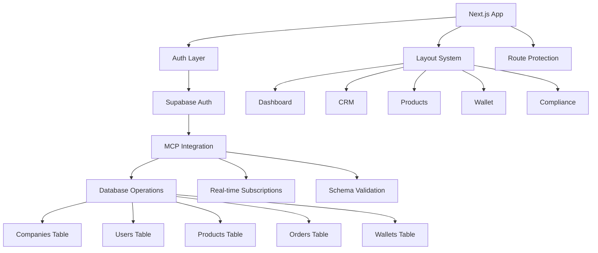

# Design Document

## Overview

This design addresses critical issues in the SME Platform application and optimizes it for Supabase MCP integration. The solution focuses on fixing configuration errors, improving TypeScript type safety, optimizing performance, and enhancing the Supabase integration to leverage MCP capabilities effectively.

## Architecture

### Current Issues Identified

1. **Configuration Issues:**
   - Next.js config has `output: 'export'` which conflicts with dynamic features
   - Missing environment variable validation
   - Hardcoded fallback values in Supabase configuration

2. **TypeScript and Build Issues:**
   - Potential missing dependencies for UI components
   - Inconsistent type definitions
   - Missing error boundaries

3. **Performance Issues:**
   - No code splitting optimization
   - Missing React Query configuration for caching
   - Potential bundle size issues

4. **Supabase Integration Issues:**
   - Database types may not match actual schema
   - Missing real-time subscriptions
   - No MCP-specific optimizations

### Proposed Architecture



## Components and Interfaces

### 1. Configuration Layer

**Environment Configuration:**
```typescript
interface EnvironmentConfig {
  supabaseUrl: string;
  supabaseAnonKey: string;
  nodeEnv: 'development' | 'production' | 'test';
  enableMCP: boolean;
}
```

**Next.js Configuration Updates:**
- Remove `output: 'export'` to enable dynamic features
- Add proper image optimization
- Configure bundle analyzer
- Add proper TypeScript checking

### 2. Enhanced Supabase Integration

**MCP-Optimized Client:**
```typescript
interface SupabaseMCPClient {
  client: SupabaseClient;
  mcpEnabled: boolean;
  realTimeSubscriptions: Map<string, RealtimeChannel>;
  queryCache: QueryClient;
}
```

**Database Type Enhancements:**
- Add proper foreign key relationships
- Include computed fields
- Add proper indexes for performance
- Include RLS (Row Level Security) policies

### 3. Error Handling System

**Global Error Boundary:**
```typescript
interface ErrorBoundaryState {
  hasError: boolean;
  error: Error | null;
  errorInfo: ErrorInfo | null;
}
```

**API Error Handler:**
```typescript
interface APIError {
  message: string;
  code: string;
  details?: any;
  timestamp: Date;
}
```

### 4. Performance Optimization Layer

**Code Splitting Strategy:**
- Lazy load route components
- Dynamic imports for heavy libraries
- Separate vendor bundles

**Caching Strategy:**
```typescript
interface CacheConfig {
  staleTime: number;
  cacheTime: number;
  refetchOnWindowFocus: boolean;
  retry: number;
}
```

## Data Models

### Enhanced Database Schema

**Users Table Enhancement:**
```sql
-- Add missing indexes and constraints
CREATE INDEX IF NOT EXISTS idx_users_company_id ON users(company_id);
CREATE INDEX IF NOT EXISTS idx_users_email ON users(email);
ALTER TABLE users ADD CONSTRAINT fk_users_company FOREIGN KEY (company_id) REFERENCES companies(id);
```

**Real-time Subscriptions:**
```typescript
interface RealtimeSubscription {
  table: string;
  event: 'INSERT' | 'UPDATE' | 'DELETE';
  filter?: string;
  callback: (payload: any) => void;
}
```

### MCP Integration Models

**MCP Query Interface:**
```typescript
interface MCPQuery {
  table: string;
  select?: string[];
  filter?: Record<string, any>;
  orderBy?: { column: string; ascending: boolean }[];
  limit?: number;
  offset?: number;
}
```

## Error Handling

### 1. Global Error Boundary
- Catch React component errors
- Log errors to monitoring service
- Display user-friendly error messages
- Provide recovery options

### 2. API Error Handling
- Standardized error response format
- Automatic retry for transient errors
- User-friendly error messages
- Proper HTTP status codes

### 3. Authentication Error Handling
- Handle expired sessions
- Manage refresh token rotation
- Graceful fallback to login
- Preserve user state during re-authentication

### 4. Database Error Handling
- Connection retry logic
- Transaction rollback on errors
- Proper constraint violation messages
- Real-time subscription error recovery

## Testing Strategy

### 1. Unit Testing
- Component testing with React Testing Library
- Hook testing with custom test utilities
- Utility function testing
- Database operation testing

### 2. Integration Testing
- API endpoint testing
- Authentication flow testing
- Database integration testing
- Real-time subscription testing

### 3. End-to-End Testing
- User journey testing
- Cross-browser compatibility
- Performance testing
- Accessibility testing

### 4. MCP Integration Testing
- Schema validation testing
- Query performance testing
- Real-time feature testing
- Error handling testing

## Performance Optimizations

### 1. Bundle Optimization
- Code splitting by routes
- Dynamic imports for heavy components
- Tree shaking for unused code
- Proper vendor chunk splitting

### 2. React Optimizations
- Memo for expensive components
- Callback optimization with useCallback
- Effect optimization with proper dependencies
- Virtual scrolling for large lists

### 3. Database Optimizations
- Proper indexing strategy
- Query optimization
- Connection pooling
- Caching frequently accessed data

### 4. Caching Strategy
- React Query for API calls
- Browser caching for static assets
- Service worker for offline support
- CDN for global asset delivery

## Security Considerations

### 1. Authentication Security
- Secure token storage
- Proper session management
- CSRF protection
- Rate limiting

### 2. Database Security
- Row Level Security (RLS) policies
- Proper access controls
- Input validation and sanitization
- SQL injection prevention

### 3. API Security
- Request validation
- Response sanitization
- Proper CORS configuration
- Security headers

### 4. Client-Side Security
- XSS prevention
- Secure local storage usage
- Content Security Policy
- Dependency vulnerability scanning