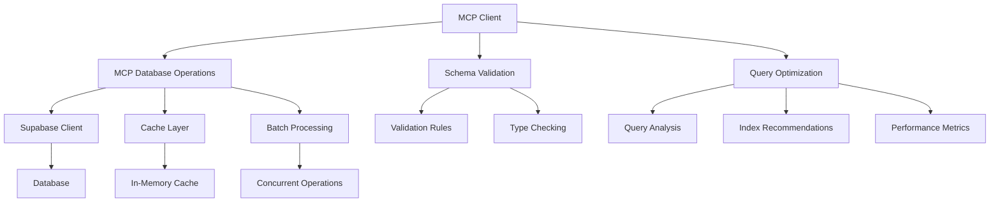

# MCP Integration Layer Documentation

## Overview

The MCP (Model Context Protocol) Integration Layer provides a comprehensive set of utilities for optimized database operations, schema validation, and query optimization when working with Supabase. This layer enhances the standard Supabase client with intelligent caching, batch processing, validation, and performance monitoring.

## Features

- **Query Optimization**: Automatic query optimization with index recommendations
- **Schema Validation**: Comprehensive validation for all database operations
- **Intelligent Caching**: Multi-level caching with TTL and size limits
- **Batch Processing**: Optimized batch operations with concurrency control
- **Performance Monitoring**: Real-time performance metrics and insights
- **Error Handling**: Enhanced error handling with retry logic
- **Type Safety**: Full TypeScript support with generated types

## Architecture



## Installation and Setup

The MCP integration layer is already included in the project. To use it:

```typescript
import { mcpClient, mcpQuery, mcpInsert } from '@/lib/mcp-utilities';
```

## Configuration

### Default Configuration

```typescript
const DEFAULT_MCP_CONFIG = {
  enableCaching: true,
  cacheTimeout: 300, // 5 minutes
  enableOptimization: true,
  enableValidation: true,
  enablePerformanceTracking: true,
  batchSize: 100,
  maxConcurrency: 3,
};
```

### Custom Configuration

```typescript
import { MCPClient } from '@/lib/mcp-utilities';

const customClient = new MCPClient(supabase, {
  enableCaching: true,
  cacheTimeout: 600, // 10 minutes
  batchSize: 200,
  maxConcurrency: 5,
});
```

## Core Components

### 1. MCP Database Operations

The core database operations class provides optimized CRUD operations:

```typescript
import { mcpQuery, mcpInsert, mcpBatchInsert, mcpUpdate, mcpUpsert } from '@/lib/mcp-utilities';

// Optimized query with caching
const products = await mcpQuery('products', {
  filter: { status: 'active', company_id: 'company-1' },
  orderBy: [{ column: 'name', ascending: true }],
  limit: 20,
});

// Validated insert
const newProduct = await mcpInsert('products', {
  name: 'New Product',
  sku: 'PROD-001',
  price: 99.99,
  company_id: 'company-1',
});

// Batch insert with optimization
const products = await mcpBatchInsert('products', productArray);
```

### 2. Schema Validation

Automatic validation for all database operations:

```typescript
import { validateTableRecord } from '@/lib/mcp-schema-validation';

const validation = validateTableRecord('products', {
  name: 'Test Product',
  sku: 'TEST-001',
  price: 99.99,
});

if (!validation.isValid) {
  console.log('Validation errors:', validation.errors);
}
```

### 3. Query Optimization

Intelligent query optimization with performance insights:

```typescript
import { optimizeQuery, recordPerformance } from '@/lib/mcp-query-optimization';

const optimization = optimizeQuery('products', {
  filter: { company_id: 'company-1' },
  orderBy: [{ column: 'name', ascending: true }],
});

console.log('Estimated cost:', optimization.estimatedCost);
console.log('Optimization hints:', optimization.hints);
```

## API Reference

### Query Operations

#### mcpQuery<T>(table, options)

Execute an optimized query with caching and performance tracking.

**Parameters:**
- `table`: Table name
- `options`: Query options (filter, orderBy, limit, offset, select)

**Returns:** `MCPOperationResult<T[]>` with metrics and optimizations

**Example:**
```typescript
const result = await mcpQuery('companies', {
  filter: { industry: 'Technology' },
  orderBy: [{ column: 'name', ascending: true }],
  limit: 10,
});
```

#### mcpQueryView<T>(viewName, options)

Query database views with optimization.

**Parameters:**
- `viewName`: View name
- `options`: Query options

**Returns:** `MCPOperationResult<T[]>` with metrics

**Example:**
```typescript
const dashboard = await mcpQueryView('company_dashboard', {
  filter: { company_id: 'company-1' },
});
```

### Insert Operations

#### mcpInsert<T>(table, record)

Insert a single record with validation.

**Parameters:**
- `table`: Table name
- `record`: Record to insert

**Returns:** `MCPOperationResult<T>` with validation result

**Example:**
```typescript
const result = await mcpInsert('products', {
  name: 'New Product',
  sku: 'PROD-001',
  price: 99.99,
  company_id: 'company-1',
});
```

#### mcpBatchInsert<T>(table, records)

Insert multiple records with batch optimization.

**Parameters:**
- `table`: Table name
- `records`: Array of records to insert

**Returns:** `MCPOperationResult<T[]>` with batch metrics

**Example:**
```typescript
const result = await mcpBatchInsert('products', [
  { name: 'Product 1', sku: 'PROD-001', price: 99.99, company_id: 'company-1' },
  { name: 'Product 2', sku: 'PROD-002', price: 149.99, company_id: 'company-1' },
]);
```

### Update Operations

#### mcpUpdate<T>(table, filter, updates)

Update records with validation.

**Parameters:**
- `table`: Table name
- `filter`: Filter criteria
- `updates`: Updates to apply

**Returns:** `MCPOperationResult<T[]>` with validation result

**Example:**
```typescript
const result = await mcpUpdate(
  'products',
  { category: 'Electronics' },
  { reorder_level: 20 }
);
```

#### mcpUpsert<T>(table, record, onConflict?)

Upsert a record with validation and optimization.

**Parameters:**
- `table`: Table name
- `record`: Record to upsert
- `onConflict`: Conflict resolution column

**Returns:** `MCPOperationResult<T>` with metrics

**Example:**
```typescript
const result = await mcpUpsert('products', {
  sku: 'PROD-001',
  name: 'Updated Product',
  price: 109.99,
}, 'sku');
```

### Function Calls

#### mcpCallFunction<T>(functionName, args)

Call database functions with caching.

**Parameters:**
- `functionName`: Function name
- `args`: Function arguments

**Returns:** `MCPOperationResult<T>` with metrics

**Example:**
```typescript
const metrics = await mcpCallFunction('get_company_metrics', {
  p_company_id: 'company-1',
  p_date_from: '2024-01-01',
  p_date_to: '2024-12-31',
});
```

### Dashboard Operations

#### mcpGetDashboard(companyId)

Fetch comprehensive dashboard data efficiently.

**Parameters:**
- `companyId`: Company ID

**Returns:** Dashboard data object with all relevant metrics

**Example:**
```typescript
const dashboard = await mcpGetDashboard('company-1');
console.log('Total orders:', dashboard.dashboard?.total_orders);
console.log('Low stock products:', dashboard.lowStockProducts.length);
```

## Validation Rules

### Built-in Validation

The MCP layer includes comprehensive validation rules for all tables:

#### Users
- Email format validation
- Role validation (admin, owner, employee)
- Company ID UUID validation

#### Companies
- Name minimum length (2 characters)
- GST number format validation
- PAN number format validation
- Email format validation

#### Products
- Name minimum length (2 characters)
- SKU minimum length (3 characters)
- Price non-negative validation
- Stock quantity non-negative validation

#### Orders
- Order number minimum length (5 characters)
- Total amount non-negative validation
- Status validation (draft, confirmed, shipped, delivered)
- Order date validation

#### Order Items
- Quantity minimum value (1)
- Unit price non-negative validation
- Subtotal calculation validation

### Custom Validation

You can extend validation rules by modifying the `DATABASE_CONSTRAINTS` object:

```typescript
import { DATABASE_CONSTRAINTS } from '@/lib/mcp-schema-validation';

// Add custom validation rules
DATABASE_CONSTRAINTS.products.custom_field = { minLength: 5 };
```

## Performance Optimization

### Query Optimization

The MCP layer automatically optimizes queries by:

1. **Field Selection**: Optimizing SELECT clauses to reduce data transfer
2. **Filter Optimization**: Reordering filters to use indexes effectively
3. **Index Recommendations**: Suggesting indexes for frequently filtered columns
4. **Pagination**: Efficient LIMIT/OFFSET handling

### Caching Strategy

Multi-level caching with intelligent invalidation:

1. **Query Results**: Cache SELECT query results with TTL
2. **Function Results**: Cache database function results
3. **View Results**: Cache view query results with longer TTL
4. **Automatic Invalidation**: Clear related cache entries on data changes

### Batch Processing

Optimized batch operations with:

1. **Chunking**: Split large batches into optimal sizes
2. **Concurrency Control**: Process batches concurrently with limits
3. **Error Handling**: Partial success handling for batch operations
4. **Progress Tracking**: Monitor batch operation progress

## Performance Monitoring

### Metrics Collection

The MCP layer collects comprehensive performance metrics:

```typescript
interface QueryPerformanceMetrics {
  executionTime: number;
  rowsScanned: number;
  rowsReturned: number;
  cacheHit: boolean;
  indexesUsed: string[];
  optimizationsApplied: string[];
  cost: number;
}
```

### Performance Insights

Get performance insights and recommendations:

```typescript
const insights = mcpClient.getPerformanceInsights();

console.log('Query patterns:', insights.patterns);
console.log('Recommendations:', insights.recommendations);
console.log('Cache statistics:', insights.cacheStats);
```

### Index Recommendations

Automatic index recommendations based on query patterns:

```typescript
interface IndexRecommendation {
  table: string;
  columns: string[];
  type: 'btree' | 'hash' | 'gin' | 'gist';
  reason: string;
  estimatedImprovement: number;
  priority: 'high' | 'medium' | 'low';
}
```

## Error Handling

### Enhanced Error Types

```typescript
interface SupabaseError extends Error {
  code?: string;
  details?: string;
  hint?: string;
  message: string;
}
```

### Validation Errors

```typescript
interface ValidationResult {
  isValid: boolean;
  errors: string[];
}
```

### Error Recovery

The MCP layer includes automatic error recovery:

1. **Retry Logic**: Automatic retries for transient errors
2. **Exponential Backoff**: Intelligent retry delays
3. **Circuit Breaker**: Prevent cascading failures
4. **Graceful Degradation**: Fallback to basic operations

## Best Practices

### 1. Use Appropriate Query Methods

```typescript
// For simple queries
const products = await mcpQuery('products', { filter: { status: 'active' } });

// For complex analytics
const dashboard = await mcpQueryView('company_dashboard', { filter: { company_id } });

// For business logic
const metrics = await mcpCallFunction('get_company_metrics', { p_company_id });
```

### 2. Leverage Batch Operations

```typescript
// Instead of multiple single inserts
for (const product of products) {
  await mcpInsert('products', product); // ❌ Inefficient
}

// Use batch insert
await mcpBatchInsert('products', products); // ✅ Efficient
```

### 3. Handle Validation Errors

```typescript
const result = await mcpInsert('products', productData);

if (result.error && result.validationResult) {
  // Handle validation errors specifically
  console.log('Validation failed:', result.validationResult.errors);
} else if (result.error) {
  // Handle other errors
  console.log('Database error:', result.error.message);
}
```

### 4. Monitor Performance

```typescript
// Regularly check performance insights
const insights = mcpClient.getPerformanceInsights();

if (insights.recommendations.length > 0) {
  console.log('Consider implementing these optimizations:', insights.recommendations);
}
```

### 5. Configure Appropriately

```typescript
// For high-throughput applications
const highThroughputClient = new MCPClient(supabase, {
  batchSize: 500,
  maxConcurrency: 10,
  cacheTimeout: 60, // Shorter cache for fresh data
});

// For read-heavy applications
const readHeavyClient = new MCPClient(supabase, {
  enableCaching: true,
  cacheTimeout: 1800, // 30 minutes
  enableOptimization: true,
});
```

## Troubleshooting

### Common Issues

#### 1. Validation Errors

**Problem**: Records failing validation
**Solution**: Check validation rules and ensure data meets requirements

```typescript
const validation = validateTableRecord('products', productData);
if (!validation.isValid) {
  console.log('Fix these issues:', validation.errors);
}
```

#### 2. Performance Issues

**Problem**: Slow query performance
**Solution**: Check optimization recommendations

```typescript
const insights = mcpClient.getPerformanceInsights();
console.log('Performance recommendations:', insights.recommendations);
```

#### 3. Cache Issues

**Problem**: Stale data from cache
**Solution**: Clear cache or reduce TTL

```typescript
// Clear all cache
mcpClient.clearCache();

// Or reduce cache timeout
mcpClient.updateConfig({ cacheTimeout: 60 });
```

#### 4. Batch Operation Failures

**Problem**: Batch operations failing
**Solution**: Reduce batch size or concurrency

```typescript
mcpClient.updateConfig({
  batchSize: 50,
  maxConcurrency: 2,
});
```

### Debug Mode

Enable debug logging by setting the environment variable:

```bash
NODE_ENV=development
```

This will enable detailed logging of:
- Query execution times
- Cache hit/miss ratios
- Validation results
- Optimization decisions

## Migration Guide

### From Standard Supabase Client

Replace standard Supabase operations with MCP equivalents:

```typescript
// Before
const { data, error } = await supabase
  .from('products')
  .select('*')
  .eq('company_id', companyId)
  .limit(10);

// After
const result = await mcpQuery('products', {
  filter: { company_id: companyId },
  limit: 10,
});
```

### Gradual Migration

You can gradually migrate by using MCP operations alongside standard ones:

```typescript
// Mix MCP and standard operations
const mcpResult = await mcpQuery('products', { filter: { status: 'active' } });
const standardResult = await supabase.from('orders').select('*').limit(5);
```

## Contributing

To contribute to the MCP integration layer:

1. Add new validation rules in `mcp-schema-validation.ts`
2. Implement new optimization strategies in `mcp-query-optimization.ts`
3. Extend the main utilities in `mcp-utilities.ts`
4. Add comprehensive tests in `__tests__/mcp-integration.test.ts`
5. Update documentation and examples

## License

This MCP integration layer is part of the SME Platform project and follows the same license terms.